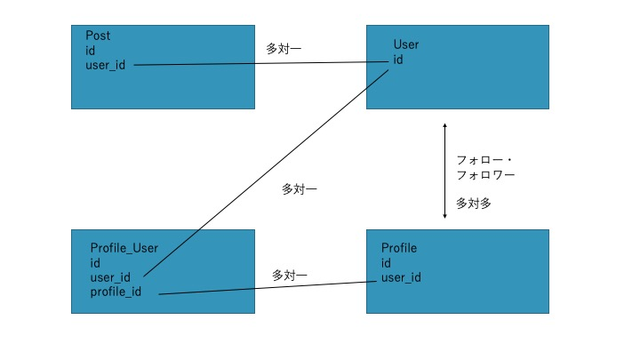

# instagram_clean

過去に作成したものをクリーンアーキテクチャに書き直してみる


## インストール

laravel・データベースの環境(mysql)は持っていることが前提

```shell
git clone https://github.com/SakaiTaka23/OrganizeNote-ver2.git
cd oraganizenote-ver2 

cp .env.example .env

composer install
php artisan key:generate
データベースを作成
.envファイルのデータベース、ユーザーネーム、パスワードの修正
php artisan migrate:fresh
php artisan serve
```


## ルート

| ルート               | メソッド | アクション | controller |
| -------------------- | -------- | ---------- | ---------- |
| follow/{user}        | post     | store      | user       |
| /profile/{user}      | get      | show       | profile    |
| /profile/{user}/edit | get      | edit       | profile    |
| /profile/{user}      | patch    | update     | profile    |

※全てにuserがプリフィックスとして付き、ログインが必要


### PostController

| Verb      | UrI              | Action  |
| --------- | ---------------- | ------- |
| GET       | /post            | index   |
| GET       | /post/create     | create  |
| POST      | /post            | store   |
| GET       | post/{post}      | show    |
| GET       | post/{post}/edit | edit    |
| PUT/PATCH | post/{post}      | update  |
| DELETE    | post/{post}      | destroy |

※全てログイン必須

※index,create,store,showは実装済み


## ビューに渡す要素

| route               | value needed                         |
| ------------------- | ------------------------------------ |
| follow/{user}       | -                                    |
| /                   | そのユーザー、そのフォロー相手の投稿 |
| /p/create           | -　投稿フォームを渡すだけ            |
| /p/{post} | 投稿一枚分の情報 |
| /p                  | -                                    |
| /profile/{user}     | そのユーザーのプロフィール情報全て   |
| /profile{user}/edit | 同上                                 |
| /profile/{user}     | -                                    |


## モデル

### Post

写真のイメージ、その説明、投稿者id

### Profile

プロフィールの情報を保持

ユーザーidや名前説明やプロフィール写真、url

### User

ログインに使用するidそのものを定義


## データベース

### posts

| id              |                        |
| --------------- | ---------------------- |
| user_id         | 所有者                 |
| caption         | 画像の説明             |
| post_image_path | 画像までのルートを保存 |


### profiles

| id                 |                        |
| ------------------ | ---------------------- |
| user_id            | 所有者                 |
| username           | ページに表示される名前 |
| description        | 簡単な説明             |
| url                | 関連するurlを書く場所  |
| profile_image_path | アイコン ルートを保存  |

### users

| id                 |                                                            |
| ------------------ | ---------------------------------------------------------- |
| name               | 名前(重複不可)　ページに表示される名前                     |
| email              | 重複不可                                                 |
| password           | パスワード                                                 |
| profile_photo_path | アイコンまでのパス laravelの機能として入れているが使わない |

### profile_user

| id         |
| ---------- |
| profile_id |
| user_id    |


### リレーション




## 機能一覧

### 画像

* 一覧表示@index
* 詳細表示@show
* 作成(投稿)@create (更新不可)
* 保存@store

### ユーザー

* プロフィール表示@index
* プロフィールの修正@edit
* プロフィールのアップデート@update


## それぞれの部品の場所

### Entities

* packages\Domain\Domain

* 結局モデルの定義をのみを書いたもの？
* リレーションを書くときはそのクラスに依存してしまうけどそれはいい？別の箇所に書くべき？→その場合の書く場所がわからない


### UseCases

* コントローラーから送られる報をもとに独自のリクエストクラスを作成
* それらの情報をもとにハンドラーとして動作を実行

上２つの関数に関して呼び出し、操作はコントローラーが行うので関係を持たせる必要はない

* create時viewを渡すだけだからリクエスト、リスポンスはクラスのみで空
* post create interacterのセーブ時にどうするか考えておくこと
  * モデルを作成した場合コンストラクタがない、しかし、ない場合作成することが難しい？


### Controllers

* 定位置に存在
* リクエストをもとにUse Casesが必要な形に整形する


### Gateways

* packages\Domain\Domain\$model\\$model RepositoryInterface
* packages\Infrastructure\\$model\\$model Repository
* モデル->save()としても良いと思うがDBファーサードを使った方が依存関係としては良い？


### Presenters

* app/Http/Presenters
* Usecases/〇〇PresenterInterface
* Use Caseから受け取ったリスポンスをもとにView Modelクラスが望む形に整形してクラスを作成し、ビューを返す


## TODO

* それぞれのルート特にposts.indexの返り値調整(返り値が入れ子になっている)
  * 渡すときにクラスを入れ替えるようにする？毎回？
* postsの残りのルート実装
* viewの仮作成
* プロフィールのルートを調整、read,updateの実装
* Readmeに全体の構造の詳細を記入

