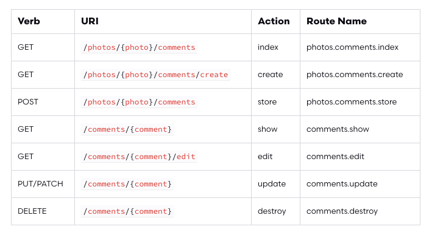
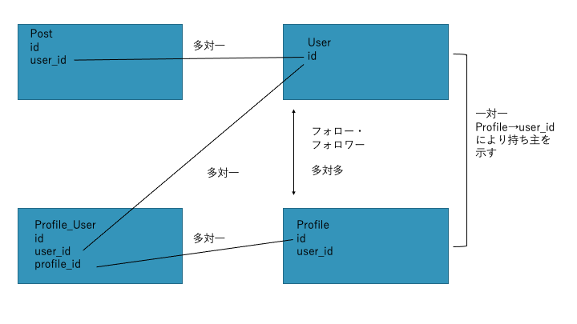
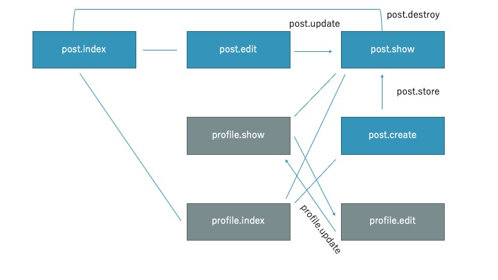

# instagram_clean

過去に作成したものをクリーンアーキテクチャに書き直してみる


## インストール

### Locally

laravel・データベースの環境(mysql)は持っていることが前提

```shell
git clone https://github.com/SakaiTaka23/instagram_clean.git
cd instagram_clean

composer install
cp .env.local.example .env

php artisan key:generate
データベースを作成
.envファイルのデータベース、ユーザーネーム、パスワードの修正
php artisan migrate:fresh
php artisan serve
```

### Laravel Sail

https://laravel.com/docs/8.x/sail

```shell
git clone https://github.com/SakaiTaka23/instagram_clean.git
cd instagram_clean

cp .env.sail.example .env

docker run --rm \
    -v $(pwd):/opt \
    -w /opt \
    laravelsail/php80-composer:latest \
    composer install

sail up -d

sail artisan key:generate
sail artisan migrate:fresh
```


## ルート





### PostController

| Method | UrI              | Action  |
| ------ | ---------------- | ------- |
| GET    | /post            | index   |
| GET    | /post/create     | create  |
| POST   | /post            | store   |
| GET    | post/{post}      | show    |
| GET    | post/{post}/edit | edit    |
| PATCH  | post/{post}      | update  |
| DELETE | post/{post}      | destroy |

※全てログイン必須


### ProfileController

| Method | Url                     | Action |
| ------ | ----------------------- | ------ |
| GET    | /profile/{profile}      | show   |
| GET    | /profile/{profile}/edit | edit   |
| PATCH  | /profile/{profile}      | update |

※全てログイン必須

※edit,updateは持ち主のみ


## ビューに渡す要素

| route               | value needed                         |
| ------------------- | ------------------------------------ |
| post.index         | そのユーザー、そのフォロー相手の投稿 |
| post.create | -　投稿フォームを渡すだけ            |
| post.show | 投稿一枚分の情報 |
| post.store        | 作成した投稿のid - showへリダイレクト             |
| post.edit | 修正する投稿の情報 - 修正フォームを渡す |
| post.update | editから受け取った情報をもとに修正 - showへリダイレクト |
| post.destroy | - indexへのリダイレクト |


| route           | value needed                       |
| --------------- | ---------------------------------- |
| profiles.index | そのユーザーの投稿 -ログイン後に入る |
| profiles.show   | そのユーザーのプロフィール情報全て |
| profiles.edit   | 同上                               |
| profilies.update | - showへリダイレクト               |


## モデル

### Post

写真のイメージ、その説明、投稿者id

### Profile

プロフィールの情報を保持

ユーザーidや名前説明やプロフィール写真、url

ユーザー作成と同時に作成

### User

ログインに使用するidそのものを定義


## データベース

### posts

| id              |                        |
| --------------- | ---------------------- |
| user_id         | 所有者                 |
| caption         | 画像の説明             |
| post_image_path | 画像までのルートを保存 |


### profiles

| id                 |                        |
| ------------------ | ---------------------- |
| user_id            | 所有者                 |
| username           | ページに表示される名前 |
| description        | 簡単な説明             |
| url                | 関連するurlを書く場所  |
| profile_image_path | アイコン ルートを保存  |

### users

| id                 |                                                            |
| ------------------ | ---------------------------------------------------------- |
| name               | 名前(重複不可)　ページに表示される名前                     |
| email              | 重複不可                                                 |
| password           | パスワード                                                 |
| profile_photo_path | アイコンまでのパス laravelの機能として入れているが使わない |

### profile_user

| id         |
| ---------- |
| profile_id |
| user_id    |


### リレーション




## 機能一覧

### 画像 post

* ランダム表示@index **ログインしていない人も閲覧可能**
* 詳細表示@show
* 作成(投稿)@create (更新不可)
* 保存@store
* 編集@edit
* 更新@update captionのみ変更可能
* 削除@destroy

### ユーザー profile

* 画像表示 (フォロー相手のも) @index 投稿のみを表示

* プロフィール表示@show あるユーザーについてプロフィール、投稿表示

* プロフィールの修正@edit 持ち主のみ
* プロフィールのアップデート@update 持ち主のみ





## バリデーション

### post.create

caption:必須、2000文字以下

image:必須、画像


### post.update

caption:必須、2000文字以下


### profile.update

image:必須、画像

username:必須、20文字以下

description:200文字以下

url:url,30文字以下


## ポリシー

* post-destroy,update,edit で実装
* modelを使って関連づける必要があるためこのためにPostモデルを作成
* 返り値は403 となっている 

### post-destroy,update,edit

User->id === Post->user_id

### post,profile-show

id exists


## インターフェースでの紐付け

* ServiceProviderを介して紐付けを行なっている
* リポジトリ、UseCase,プレゼンターを紐づけている
* サービスプロパイダもそれぞれについて分た
  * プレゼンター→PresenterServiceProvider
  * リポジトリ→RepositoryServiceProvider
  * ユースケース→UseCaseServiceProvider


## それぞれの部品の場所

### Entities

* packages\Domain\Domain

* 結局モデルの定義をのみを書いたもの？
* リレーションを書くときはそのクラスに依存してしまうけどそれはいい？別の箇所に書くべき？→その場合の書く場所がわからない


### UseCases

* コントローラーから送られる報をもとに独自のリクエストクラスを作成
* それらの情報をもとにハンドラーとして動作を実行

上２つの関数に関して呼び出し、操作はコントローラーが行うので関係を持たせる必要はない

* create時viewを渡すだけだからリクエスト、リスポンスはクラスのみで空
* post create interacterのセーブ時にどうするか考えておくこと
  * モデルを作成した場合コンストラクタがない、しかし、ない場合作成することが難しい？


### Controllers

* 定位置に存在
* リクエストをもとにUse Casesが必要な形に整形する


### Gateways

* packages\Domain\Domain\$model\\$model RepositoryInterface
* packages\Infrastructure\\$model\\$model Repository
* モデル->save()としても良いと思うがDBファーサードを使った方が依存関係としては良い？


### Presenters

* app/Http/Presenters
* Usecases/〇〇PresenterInterface
* Use Caseから受け取ったリスポンスをもとにView Modelクラスが望む形に整形してクラスを作成し、ビューを返す
* View Modelに関してDomain内のクラスなどに頼る必要があった場合は別途それ用のクラスをview modelのcommonsといったフォルダを作成して適用させる


## TODO

* 登録時にメールを送ることができるようにする